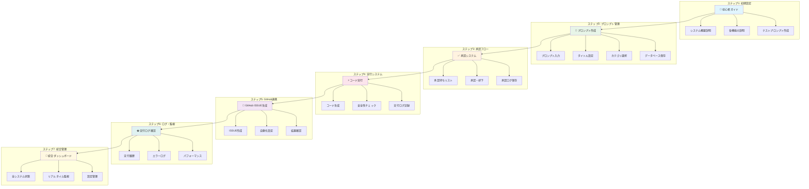

# 🚀 AI-Human協働開発システム - 完全ガイド

## 📊 システム全体フロー（Mermaid図）



## 🎯 初心者向け使用手順

### 🔧 事前準備
1. ブラウザで `http://localhost:7860` にアクセス
2. 「🚀 初心者ガイド」タブを開く
3. 各ステップを上から順番に実行

### ステップ1: システム理解 🎯
1. **初心者ガイド**タブを開く
2. システム概要を確認
3. 各機能の説明を読む
4. 「システム状態をチェック」ボタンをクリック

### ステップ2: プロンプト作成 📝
1. **プロンプト管理システム**タブを開く
2. 新しいプロンプトを入力
3. タイトルとカテゴリを設定
4. 「🚀 プロンプト作成」ボタンをクリック

### ステップ3: 承認プロセス ✅
1. **統合承認システム**タブを開く
2. 「📋 承認待ちプロンプト確認」をクリック
3. 承認または却下を選択
4. 「✅ 承認実行」ボタンをクリック

### ステップ4: コード実行 ⚡
1. 「🚀 実行シミュレーション」をクリック
2. **実行ログ**で進行状況を確認
3. エラーがあれば修正提案を確認

### ステップ5: GitHub連携 🚀
1. **GitHub ISSUE自動化**タブを開く
2. 「🐙 GitHub Issue作成シミュレーション」をクリック
3. 自動化設定を確認

### ステップ6: 総合確認 🎯
1. **統合管理ダッシュボード**で全体状況を確認
2. 「📊 システム状態確認」をクリック
3. 必要に応じて設定を調整

## 🔧 詳細ステップ説明

### ステップ1: システム起動確認 🎯
- app.pyが正常に動作しているか確認
- データベース接続テスト
- 各種サービスの状態チェック

### ステップ2: プロンプト作成・保存 📝
- 新しいプロンプトをテキストエリアに入力
- タイトルと内容を設定
- データベースに保存

### ステップ3: 承認キューに追加 📨
- 作成したプロンプトを承認システムに送信
- 優先度設定
- 承認待ち状態に移行

### ステップ4: 承認・拒否判定 🤔
- 管理者による内容確認
- 承認または拒否の決定
- 理由の記録

### ステップ5: 自動実行 🚀
- 承認されたプロンプトの自動処理
- AIによるコード生成
- ファイルシステムへの出力

### ステップ6: GitHub連携 🐙
- 自動Issue作成
- 結果のリポジトリ反映
- ドキュメント生成

### ステップ7: ログ・完了 📊
- 実行結果の記録
- 成功・失敗の判定
- レポート生成

## 💡 使い方のコツ

1. **順番を守る**: 上から順番に実行することで確実に動作します
2. **エラー時は前のステップに戻る**: 問題があれば一つ前のステップから再実行
3. **ログを確認**: 各ステップで出力されるログでトラブルシューティング
4. **テストデータを使用**: 最初は簡単なテストデータで動作確認

## 🎯 成功パターン例

```
✅ システム起動確認 → OK
✅ プロンプト作成 → "簡単な計算機を作成してください"
✅ 承認キュー追加 → 優先度: 3
✅ 承認処理 → 承認者: システム管理者
✅ 自動実行開始 → コード生成中...
✅ ファイル作成 → calculator.py 作成完了
✅ GitHub Issue → #123 作成完了
✅ 実行完了 → 所要時間: 45秒
```
