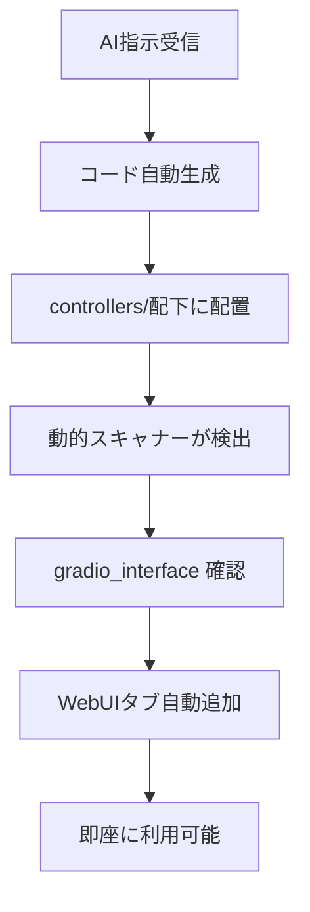

# 🏗️ システムアーキテクチャ

## 🎯 システム概要

**FastAPI Django Main Live**は、**AI協働開発**により構築された自動成長型Webアプリケーションです。

### 🌟 核心コンセプト
- **動的機能拡張**: AIの指示だけで新機能を自動追加
- **命名規則による自動統合**: 特定の名前を使うだけで機能統合
- **プラグイン式アーキテクチャ**: 既存機能に影響せずに機能追加
- **ゼロ設定ファイル**: 複雑な設定なしで即座に動作

## 🏢 アーキテクチャ全体像

```
┌─────────────────────────────────────────────────────────┐
│                   🌐 Web ブラウザ                        │
└─────────────────────┬───────────────────────────────────┘
                      │ HTTP/WebSocket
┌─────────────────────┴───────────────────────────────────┐
│                🚀 FastAPI Core                          │
│  ┌─────────────────┬─────────────────┬─────────────────┐ │
│  │   📊 Gradio     │   🔄 Django     │   🤖 AI Core   │ │
│  │   WebUI         │   Backend       │   OpenAI/Groq   │ │
│  └─────────────────┴─────────────────┴─────────────────┘ │
└─────────────────────┬───────────────────────────────────┘
                      │
┌─────────────────────┴───────────────────────────────────┐
│           🔄 動的ルーターインポートシステム                │
│  ┌─────────────────────────────────────────────────────┐ │
│  │  controllers/ スキャナー (mysite/routers/gradio.py) │ │
│  │  • gradio_interface 自動検出                        │ │
│  │  • router 自動検出                                 │ │
│  │  • 新機能の即座統合                                 │ │
│  └─────────────────────────────────────────────────────┘ │
└─────────────────────┬───────────────────────────────────┘
                      │
┌─────────────────────┴───────────────────────────────────┐
│                📦 機能モジュール群                       │
│  ┌─────────────────┬─────────────────┬─────────────────┐ │
│  │  🏠 ContBK      │  🐙 GitHub      │  🖼️ RPA        │ │
│  │  ダッシュボード   │  Issue 作成     │  画像取得       │ │
│  └─────────────────┼─────────────────┼─────────────────┤ │
│  │  💬 AI Chat     │  📊 Database    │  🔧 Debug      │ │
│  │  OpenInterpreter│  操作           │  VS Code連携    │ │
│  └─────────────────┴─────────────────┴─────────────────┘ │
└─────────────────────┬───────────────────────────────────┘
                      │
┌─────────────────────┴───────────────────────────────────┐
│                💾 データ層                               │
│  ┌─────────────────┬─────────────────┬─────────────────┐ │
│  │  📝 SQLite      │  📂 ファイル      │  🌐 外部API    │ │
│  │  各種DB         │  システム        │  GitHub/Groq   │ │
│  └─────────────────┴─────────────────┴─────────────────┘ │
└─────────────────────────────────────────────────────────┘
```

## 🔄 動的インポートシステム（核心技術）

### 📍 自動検出の仕組み

#### 1. ディレクトリスキャン
```python
# mysite/routers/gradio.py
def include_gradio_interfaces():
    package_dir = "controllers"  # スキャン対象
    
    # controllers/ 配下をすべて探索
    for root, dirs, files in os.walk(package_dir):
        for file in files:
            if file.endswith('.py'):
                # Python モジュール自動インポート
                module = importlib.import_module(module_path)
                
                # gradio_interface オブジェクト検出
                if hasattr(module, 'gradio_interface'):
                    # 自動でWebUIに統合
                    interfaces[tab_name] = module.gradio_interface
```

#### 2. 命名規則による自動統合
```python
# ✅ 自動検出される例
gradio_interface = gr.Interface(...)  # 必須の名前
router = APIRouter()                  # 必須の名前

# ❌ 検出されない例
interface = gr.Interface(...)         # 名前が違う
my_router = APIRouter()              # 名前が違う
```

#### 3. 即座の機能統合
- サーバー再起動不要
- 新しいタブが自動表示
- 既存機能への影響なし

## 🛠️ 技術スタック詳細

### 🎨 フロントエンド層
```
🌐 Gradio WebUI
├── 📊 Blocks Layout Engine
├── 🎯 Component System (Textbox, Button, etc.)
├── 📱 Responsive Design
└── ⚡ Real-time Updates
```

### ⚙️ バックエンド層
```
🚀 FastAPI Framework
├── 🔄 Django Integration
├── 📡 RESTful API
├── 🔌 WebSocket Support
└── 🛡️ Middleware Stack
```

### 🤖 AI統合層
```
🧠 AI Engine
├── 🤖 OpenInterpreter (Code Execution)
├── ⚡ Groq API (LLM Inference)
├── 🧩 GitHub Copilot (Code Generation)
└── 💬 Natural Language Processing
```

### 🔧 自動化層
```
🤖 RPA System
├── 🎭 Playwright (Browser Automation)
├── 📸 Screenshot Capture
├── 🖼️ Image Collection
└── 📊 Execution History
```

### 💾 データ層
```
📊 Database Layer
├── 💬 chat_history.db (チャット履歴)
├── 🤖 rpa_history.db (RPA実行記録)
├── 📝 conversation_history.db (会話記録)
└── 📋 prompts.db (プロンプト管理)
```

## 📁 ディレクトリ構造と責務

### 🎯 核心ディレクトリ
```
fastapi_django_main_live/
├── app.py                          # 🚀 メインアプリケーション
├── mysite/                         # 🔄 Django統合・ルーティング
│   └── routers/gradio.py           # ⭐ 動的インポートエンジン
├── controllers/                    # 📦 機能モジュール群
│   ├── gra_01_chat/               # 💬 基本チャット
│   ├── gra_02_openInterpreter/    # 🤖 AI統合
│   ├── contbk_unified_dashboard.py # 🏠 統合ダッシュボード
│   ├── conversation_logger.py      # 📝 会話記録
│   └── github_issue_creator.py     # 🐙 Issue作成
└── contbk/                        # 🔧 高度な機能群
    └── gra_12_rpa/                # 🖼️ RPA・画像取得
```

### 📋 機能別ディレクトリ
```
controllers/gra_XX_功能名/          # Gradio UI機能
├── __init__.py                    # パッケージ初期化
├── main.py                        # メイン実装
└── gradio_interface              # ⭐ 必須オブジェクト

routers/api_XX_功能名.py           # FastAPI エンドポイント
└── router                        # ⭐ 必須オブジェクト
```

## 🔌 プラグイン式機能追加システム

### 🎯 新機能追加フロー

#### 1. AI指示による要求
```
ユーザー: 「天気予報機能を追加して」
```

#### 2. AI による自動実装
```python
# controllers/gra_13_weather/weather.py を自動生成
import gradio as gr
import requests

def get_weather(city):
    # 天気API呼び出し
    return f"{city}の天気: 晴れ"

# この名前でないと自動統合されない
gradio_interface = gr.Interface(
    fn=get_weather,
    inputs=gr.Textbox(label="都市名"),
    outputs=gr.Textbox(label="天気"),
    title="🌤️ 天気予報"
)
```

#### 3. 自動統合・即座利用
- `controllers/` にファイル配置
- 動的スキャナーが自動検出
- WebUIタブに即座表示
- ユーザーがすぐに利用可能

### 🔄 自動統合の流れ



## 🔐 セキュリティアーキテクチャ

### 🛡️ 多層防御システム
```
🔐 Security Layers
├── 🌐 Web Layer (HTTPS, CORS)
├── 🔑 Auth Layer (Environment Variables)
├── 🛡️ App Layer (Input Validation)
├── 💾 Data Layer (SQLite Encryption)
└── 🔧 Debug Layer (Dev-only Access)
```

### 🔑 認証・認可
- **環境変数**: 機密情報の安全管理
- **パスワード認証**: OpenInterpreter 保護
- **GitHub CLI**: 自動認証
- **デバッグ環境**: 開発時のみアクセス

## 📊 パフォーマンス設計

### ⚡ 高速化技術
- **非同期処理**: `async/await` による並行処理
- **動的ロード**: 必要な機能のみ読み込み
- **キャッシュ**: 重複処理の削減
- **軽量DB**: SQLite による高速データアクセス

### 📈 スケーラビリティ
- **モジュラー設計**: 機能の独立性
- **プラグイン式**: 無制限の機能拡張
- **自動統合**: 設定ファイル不要
- **メモリ効率**: リソース使用量最適化

## 🔄 データフロー

### 📊 主要なデータの流れ

#### 1. ユーザー入力 → AI処理
```
ブラウザ → FastAPI → OpenInterpreter → AI処理 → レスポンス
```

#### 2. 機能追加フロー
```
AI指示 → コード生成 → ファイル配置 → 自動検出 → UI統合
```

#### 3. データ永続化
```
ユーザー操作 → アプリ処理 → SQLite保存 → 履歴管理
```

## 🚀 拡張性設計

### 🔮 将来の拡張可能性

#### 技術拡張
- **PostgreSQL**: より高性能なデータベース
- **Redis**: キャッシュ・セッション管理
- **Docker**: コンテナ化
- **Kubernetes**: オーケストレーション

#### 機能拡張
- **多言語対応**: 国際化
- **モバイルアプリ**: React Native連携
- **クラウド統合**: AWS/Azure連携
- **エンタープライズ**: 大規模運用対応

### 💡 設計原則

#### 1. **Keep It Simple**
- 複雑さよりもわかりやすさ
- 設定ファイルよりも命名規則
- ドキュメントよりも直感的操作

#### 2. **Convention over Configuration**
- 決まった場所に決まった名前で配置
- 自動検出による設定レス
- 一貫性のある命名規則

#### 3. **AI-First Design**
- AIによる自動生成を前提
- 自然言語での操作
- 人間とAIの協働最適化

---

**アーキテクト**: GitHub Copilot AI + miyataken999  
**設計思想**: AI協働による自動成長システム  
**最終更新**: 2025年06月11日

> 🏗️ **このアーキテクチャは、AIと人間が協働して設計した革新的なシステムです。技術的な完璧さだけでなく、使いやすさと拡張性を両立しています。**
